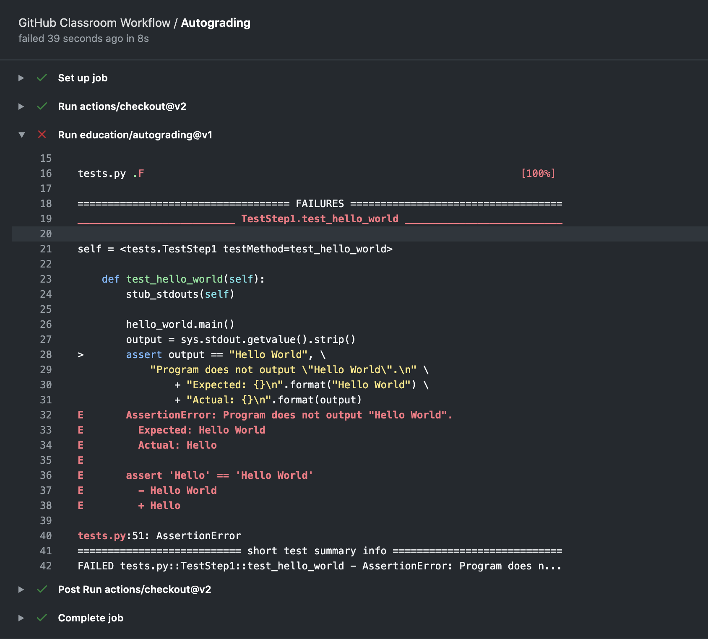
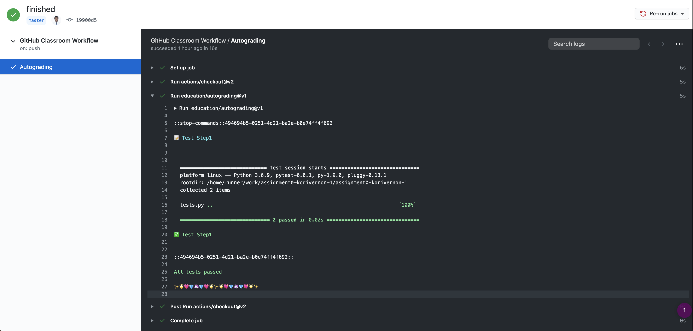
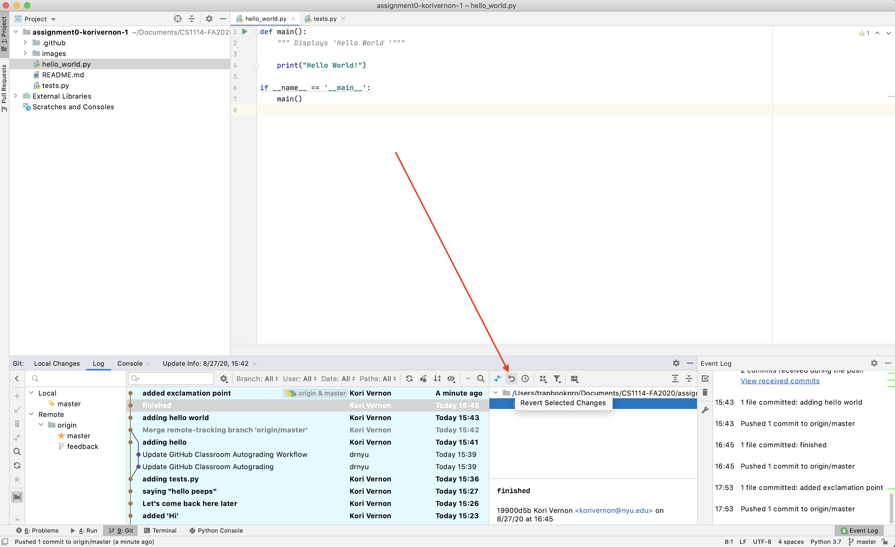
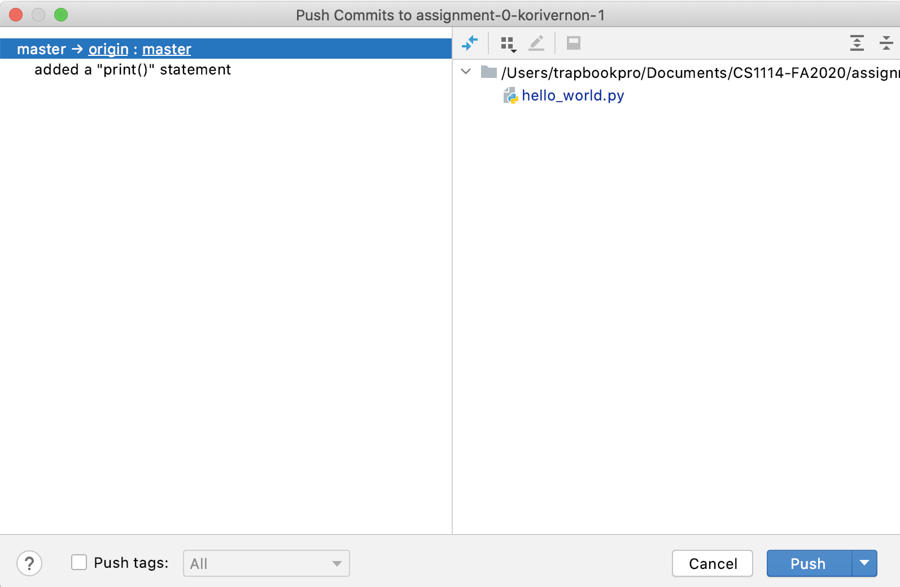

## Assignment 0 - Getting Acclimated

### BACKGROUND

This assignment will familiarize you with the recommended process for editing, testing, and uploading code to complete programming assignments. In this course, we recommend you use a combination of PyCharm, GitHub Desktop, and GitHub Classrooms to complete programming assignments.

Let's get started. 

#### TABLE OF CONTENTS
0. [Sign Up for GitHub and Install Python](#register)
1. [Installing PyCharm](#install)
    1. [Installing PyCharm for Windows](#winpy)
    2. [Installing PyCharm for Mac](#macpy)
2. [Add/Commit/Push Sequence in PyCharm](#config)
    1. [Config for Windows](#wingh)
    2. [Config for Mac](#macgh)
3. [(Optional) Installing GitHub Desktop](#gitdesk)
    1. [Installing GitHub Desktop for Windows](#windesk)
    2. [Installing GitHub Desktop for Mac](#macdesk)
4. [Assignment](#assignment)
5. [Reverting to Previous Versions](#revert)

<a name="register"></a>

## Step 0: Sign Up for GitHub and Install Python

If you have not already created a GitHub account, please do so right now. *(Go ahead and put a 'lil bio, tell us about yourself and aspirations!)*

**1.** Click [here](https://github.com/join?ref_cta=Sign+up&ref_loc=header+logged+out&ref_page=%2F&source=header-home) to sign up.

Got your GitHub now? Great! Keep your credentials handy throughout the configuration process.

**2. Now let's install Python.** 

If you are on a **Mac Machine**, click [here](https://www.python.org/ftp/python/3.7.9/python-3.7.9-macosx10.9.pkg) to install Python. Keep note of where you installed Python on your machine. 

If you are on a **Windows Machine**, click [here](https://www.python.org/ftp/python/3.7.9/python-3.7.9-amd64.exe) to install Python. Keep note of where you installed Python on your machine. 

Got Python now? Great! Let's keep going.

<a name="install"></a>

## Step 1: Installing PyCharm

<a name="winpy"></a>

### Windows

**1.** Download PyCharm using this link [here](https://www.jetbrains.com/edu-products/download/download-thanks-pce.html?platform=windows)

**2.** When you are downloading PyCharm, create a folder ‘CS-1114’ where you will place all of your files related to the class. Organization is important when you are using Git. This is strongly recommended but not necessary. 


**3.** Configure and install PyCharm Edu. 

**4.** Launch PyCharm Edu. This is what you should see below on your homescreen.


[Next Section: Add/Commit/Push Sequence in PyCharm](#config)

<a name="macpy"></a>

### Mac OS 

**1.** Download PyCharm using this link [here](https://www.jetbrains.com/edu-products/download/download-thanks-pce.html?platform=mac)

***1.2)*** Recommended but not necessary: Create a folder 'CS-1114' to organize your assignments.


**2.** Open 'pycharm-edu-2020.x.dmg' file and drag 'PyCharm' to 'Applications'.


**3.** Open 'PyCharm Edu' application once it is downloaded.

**4.** Use 'Previous version' to import PyCharm Settings


**Congratulations! You have successfully installed PyCharm for Mac OS!**

This is what you should be presented with:


## Step 2: 

<a name="config"></a>

### Configuring PyCharm and GitHub

<a name="wingh"></a>

[Jump to Mac OS: Config for Mac](#macgh)

#### Windows 

**1.** Launch PyCharm Edu. This is what you should see below on your homescreen.


**1.** Select ‘Get from Version Control’. 

**3. Download and install Git if you have not already on the ‘Repository URL’ tab.** <-- This is very important

Select ‘GitHub’ and then select ‘Log In via GitHub’.’


**4.** Login and authorize PyCharm Edu to use GitHub. Once you finish, you will get this message on JetBrains’ website. 

Now that GitHub is connected and installed, now you can clone your folder. 
Find, then clone your repository inside of the ‘CS-1114’ folder that we created earlier. 


This should happen if everything is done correctly. 


**5.** In order to run your code, you will have to configure your virtual environment. You should have a yellow bar across the top of your screen. Select ‘Configure Python interpreter’ and then select ‘Add interpreter…’


**6.** Refer to this link [here](https://www.jetbrains.com/help/pycharm/configuring-local-python-interpreters.html) to set up your interpreter. 

**7.** Change the code a little bit. 

Now let’s work on committing. Press ‘Alt+`’. This will bring up the window below. Select ‘1.Commit…’


**8.** This should bring up a side panel that prompts you for your commit message. Enter in a message with the details of what you changed. The ‘Commit’ button should be blue. Click on the down arrow next to the ‘Commit’ button and select ‘Commit and Push…’


A last message will pop up where you will confirm that you want to push commits to GitHub. 


[Next Section: (Optional) Installing GitHub Desktop](#gitdesk)

#### Mac OS 

<a name="macgh"></a>

**1.** When you first open PyCharm, it will ask you where you would like to bring your file in from. Select "Get from Version Control"


**Download and install Git if you have not already on the ‘Repository URL’ tab.** <-- This is very important

**2.** Select GitHub, and then login. 


**3.** Login using your GitHub credentials and request access for the repositories for the class. 


**4.** Once you authorize GitHub, your repositories should appear, along with your GitHub username in the PyCharm Version Control Window. 

**5.** Select the repository you want to work in and then hit clone. Your repository will open inside of PyCharm. 

### Virtual Environment

If you get a virtual environment error (yellow bar at the top of your screen), you need to set up a virtual environment. 


To remedy this situtation, follow these steps.

**1.** In order to run your code, you will have to configure your virtual environment. You should have a yellow bar across the top of your screen. Select ‘Configure Python interpreter’ and then select ‘Add interpreter…’


**6.** Refer to this link [here](https://www.jetbrains.com/help/pycharm/configuring-local-python-interpreters.html) to set up your interpreter. 

### Commit/Push Sequence using PyCharm

This part is extremely important because this is how you submit your assignments for grading! It is imperative that you understand how the 'Commit-Push/Pull' sequence works. 

**1.** After you make your changes to the file, select the 'Commit' checkmark in the bottom right hand corner of the screen. 


**2.** A box will pop up with information regarding your commit. You will have a space to enter in a message about your commit (a). Select the drop down menu, and then press 'Commit and Push'.


**3.** After this, another textbox will pop up and you will confirm that you want to push the commits that you have staged. Hit 'Push' to confirm. 


<a name="gitdesk"></a>

## Step 3: (Optional) Installing GitHub Desktop 

[Skip This Section](#assignment)

**1.** Visit this [website](https://desktop.github.com/) and choose your operating system to download GitHub Desktop.


<a name="windesk"></a>

### Windows

Follow directions on website. 

<a name="macdesk"></a>

### Mac OS  

**2.** Install the GitHubDesktop zip file. 


**3.** You may get this warning when you install on Mac OS - it is OK. 


**4.** Sign in to GitHub.com using your GitHub account. 


**5.** Login and authorize GitHub Desktop to be used.

**6.** Cycle through the instructions and grant GitHub Desktop permission and access to the folders that you are working in.


**7.** Once you have finished authorizing GitHub Destktop, now you can choose the corresponding repository to work in. 


**8.** Find your example repository (for you it may be different), and select it. 

**9.** Select the option to clone your target repository. You will be presented with a screen that asks you for your local path inside of your machine. 


**10.** Choose the correct local path. In our case, you are looking for the 'CS-1114' Folder. Once you have selected the correct folder, select 'Open'.


**11.** Now that your repo is selected, and you have successfully cloned the correct file onto your machine, now you have to open it in your code editor of choice (for this class, it is recommended that you use PyCharm). If your default editor is not PyCharm, this is how you change it. 


***11.1*** Select your preferred editor (PyCharm is recommended for this class).


**12. Your First Commit!** - Now that you have configured everything, now you will commit your changes to GitHub. Type in your message, and select 'Commit to master'


***12.1*** We are not done yet! Now we have to push our commits to the 'Origin Remote'. Push 'Push Origin', and once it finishes, congratulations! You have pushed your first commit to GitHub. 


<a name="assignment"></a>

## Step 3: Hello World Assignment

First clone your repository so you can begin working on it. 

Open PyCharm Edu and select 'Get from Version Control'.

Select the GitHub tab and then select your assignment and open it inside of your 'CS-1114' directory. 


When we are finished cloning our repository, this is what we will see:


In this assignment, you will be tasked with creating a `Hello World` file.

The starter code has been provided for you in the file `hello_world.py`. Open the from 'GitHub Desktop' inside of 'PyCharm' and modify the file so that it prints "Hello World".

```out 
def main():
    """ Displays 'Hello World'"""
    pass

if __name__ == '__main__':
    main()
```

**1.** First, replace `pass` with `print('Hello')`. Run your code (Green Play Button). What happened? Commit and push your changes to GitHub. What happened? write it down in a comment, using `'''Summary 1:` before your comment, and `'''` to denote at the end. It should look something like this:

```out 
def main():
    """ Displays 'Hello World'"""
    print('Hello')
    '''Summary (1): It did something!'''

if __name__ == '__main__':
    main()
```

After you commit, you should receive an email that looks like this:


Click on 'View results' and it should take you to this page. 


The actions page will tell you what is going on. This is where you can view the results of your tests. Click on 'Autograding' and then select the 'Run education/autograding@v1' tab. This will open a drop down that has the results of your test, which should look like the following. 



Notice that the output says it did not match the expected output.

**2.** Comment out the `'print('Hello')'` statement, and Make the corresponding changes. Start a new line in which you output `'Hello World'` to the console. Run your code. What happened? Commit and push the changes to GitHub.

```out 
def main():
    """ Displays 'Hello World'"""
    # print('Hello')
    '''Summary (1): It did something!'''
    
    print('Random Things Inside of Here')
    '''Summary (2): It did something!'''

if __name__ == '__main__':
    main()
```

You should **NOT** receive an email if it is done correctly. To double check, go back to the 'Actions' tab and select 'Autograding'. Make sure that your 'Run education/autograding@v1' looks exactly like this:



**3.** To practice reverting changes, add an exclamation point to the end of ```Hello World!``` save and commit your changes to GitHub. 

This will result in our code failing the autograder. Instead of deleting the changes, revert to the previous version where we had ```Hello World```. To do this, select `Git` in the bottom left hand corner. It will bring up a panel. Select the commit message that you would like to select and the file that you would like to apply it to, and then press the little grey return arrow. 



Add a comment then select 'OK'.


It will bring up this 'Patch Conflict' panel. Select 'Apply' if you want to revert to this version in history. Otherwise, select 'Abort'. 


You will get a message `There is one conflict left unprocessed. Save changes and mark the conflict resolved anyways`. Select `Apply Changes and Mark Resolved`. 

Congratualtions, you have just gone back to a previous version of your code using Version Control!

## You have just completed your first assignment! 

### If you are still having issues...

When you select Commit in your VCS menu (Mac: `Command+K`, Windows: `alt+K`) it will bring up a commit dialog box. 


Push your commit to GitHub. 



<a name="revert"></a>

## Reverting to Previous Versions 

The benefit of Git is that every time you commit and push your changes, a copy of your code at that point in time. 

To use PyCharm to revert to previous changes, take a look at **this** [video](https://www.youtube.com/watch?v=xx-oIxAR-u0).

### GETTING HELP

If you are having trouble setting up these programs, please talk to a TA or Professor as soon as possible.

