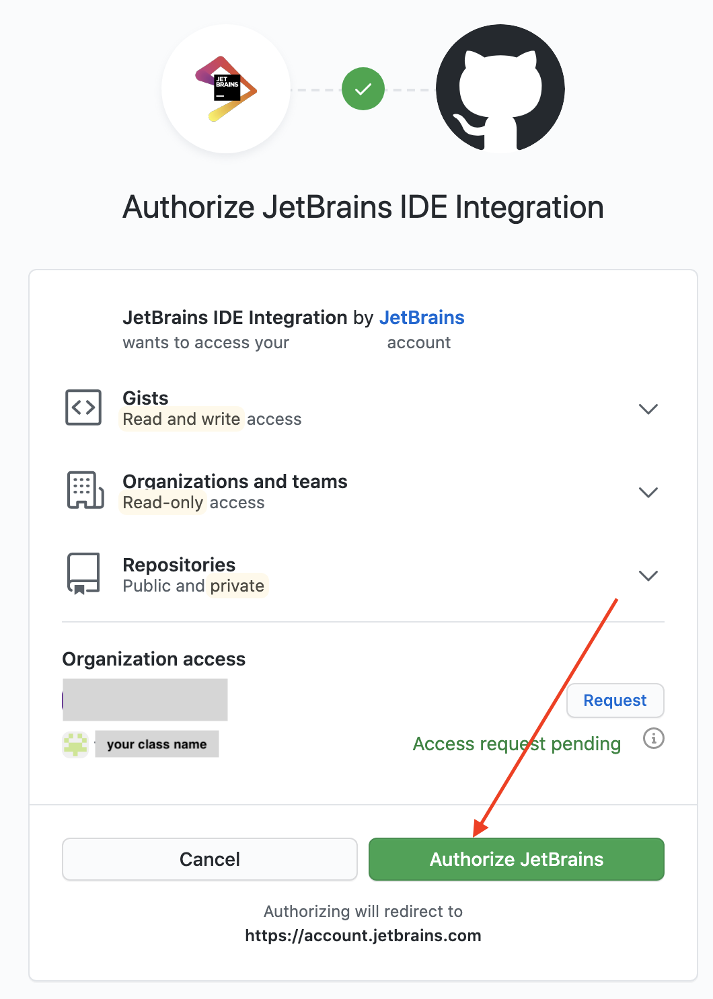

## Assignment 0 - Getting Acclimated

### BACKGROUND

This assignment will familiarize you with the recommended process for editing, testing, and uploading code to complete programming assignments. In this course, we recommend you use a combination of PyCharm, GitHub Desktop, and GitHub Classrooms to complete programming assignments.

Let's get started. 

#### TABLE OF CONTENTS
0. [Sign Up for GitHub](#register)
1. [Installing PyCharm](#install)
    1. [Installing PyCharm for Windows](#winpy)
    2. [Installing PyCharm for Mac](#macpy)
2. [Add/Commit/Push Sequence in PyCharm](#config)
3. [(Optional) Installing GitHub Desktop](#gitdesk)
    1. [Installing GitHub Desktop for Windows](#windesk)
    2. [Installing GitHub Desktop for Mac](#macdesk)
4. [Assignment](#assignment)

<a name="register"></a>

## Step 0: Sign Up for GitHub

If you have not already created a GitHub account, please do so right now. 

Click [here](https://github.com/join?ref_cta=Sign+up&ref_loc=header+logged+out&ref_page=%2F&source=header-home) to sign up.

Got it now? Great! Keep your credentials handy throughout the configuration process.


<a name="install"></a>

## Step 1: Installing PyCharm

<a name="winpy"></a>

### Windows

**1.** Download PyCharm using this link [here](https://www.jetbrains.com/edu-products/download/download-thanks-pce.html?platform=windows)

**2.** Follow directions listed on website. 

<a name="macpy"></a>

### Mac OS 

**1.** Download PyCharm using this link [here](https://www.jetbrains.com/edu-products/download/download-thanks-pce.html?platform=mac)

***1.2)*** Recommended but not necessary: Create a folder 'CS-1114' to organize your assignments.


**2.** Open 'pycharm-edu-2020.x.dmg' file and drag 'PyCharm' to 'Applications'.


**3.** Open 'PyCharm Edu' application once it is downloaded.

**4.** Use 'Previous version' to import PyCharm Settings


**Congratulations! You have successfully installed PyCharm for Mac OS!**

This is what you should be presented with:


## Step 2: 

<a name="config"></a>

### Configuring PyCharm and GitHub

**1.** When you first open PyCharm, it will ask you where you would like to bring your file in from. Select "Get from Version Control"


**2.** Select GitHub, and then login. 


**3.** Login using your GitHub credentials and request access for the repositories for the class. 



**4.** Once you authorize GitHub, your repositories should appear, along with your GitHub username in the PyCharm Version Control Window. 

**5.** Select the repository you want to work in and then hit clone. Your repository will open inside of PyCharm. 

### Virtual Environment

If you get a virtual environment error (yellow bar at the top of your screen), you need to set up a virtual environment. 


To remedy this situtation, follow these steps.

**1.** Select 'Configure Python interpreter' > 'Add new interpreter'. Then under the 'Virtualenv Environment' tab, ensure that you are in your target location. Select 'OK'


### Commit/Push Sequence using PyCharm

This part is extremely important because this is how you submit your assignments for grading! It is imperative that you understand how the 'Commit-Push/Pull' sequence works. 

**1.** After you make your changes to the file, select the 'Commit' checkmark in the bottom right hand corner of the screen. 


**2.** A box will pop up with information regarding your commit. You will have a space to enter in a message about your commit (a). Select the drop down menu, and then press 'Commit and Push'.


**3.** After this, another textbox will pop up and you will confirm that you want to push the commits that you have staged. Hit 'Push' to confirm. 


<a name="gitdesk"></a>

## Step 3: (Optional) Installing GitHub Desktop 

[Skip This Section](#assignment)

**1.** Visit this [website](https://desktop.github.com/) and choose your operating system to download GitHub Desktop.


<a name="windesk"></a>

### Windows

Follow directions on website. 

<a name="macdesk"></a>

### Mac OS  

**2.** Install the GitHubDesktop zip file. 


**3.** You may get this warning when you install on Mac OS - it is OK. 


**4.** Sign in to GitHub.com using your GitHub account. 


**5.** Login and authorize GitHub Desktop to be used.

**6.** Cycle through the instructions and grant GitHub Desktop permission and access to the folders that you are working in.


**7.** Once you have finished authorizing GitHub Destktop, now you can choose the corresponding repository to work in. 


**8.** Find your example repository (for you it may be different), and select it. 

**9.** Select the option to clone your target repository. You will be presented with a screen that asks you for your local path inside of your machine. 


**10.** Choose the correct local path. In our case, you are looking for the 'CS-1114' Folder. Once you have selected the correct folder, select 'Open'.


**11.** Now that your repo is selected, and you have successfully cloned the correct file onto your machine, now you have to open it in your code editor of choice (for this class, it is recommended that you use PyCharm). If your default editor is not PyCharm, this is how you change it. 


***11.1*** Select your preferred editor (PyCharm is recommended for this class).


**12. Your First Commit!** - Now that you have configured everything, now you will commit your changes to GitHub. Type in your message, and select 'Commit to master'


***12.1*** We are not done yet! Now we have to push our commits to the 'Origin Remote'. Push 'Push Origin', and once it finishes, congratulations! You have pushed your first commit to GitHub. 


<a name="assignment"></a>

## Step 3: Hello World Assignment

In this assignment, you will be tasked with creating a `Hello World` file.

The starter code has been provided for you in the file `hello_world.py`. Open the from 'GitHub Desktop' inside of 'PyCharm' and modify the file so that it prints "Hello World".

```out 
def main():
    """ Displays 'Hello World'"""
    pass

if __name__ == '__main__':
    main()
```

**1.** First, replace `pass` with `print()`. Run your code (Green Play Button). What happened? Commit and push your changes to GitHub. What happened? write it down in a comment, using `'''Summary 1:` before your comment, and `'''` to denote at the end. It should look something like this:

```out 
def main():
    """ Displays 'Hello World'"""
    print()
    '''Summary (1): It did something!'''

if __name__ == '__main__':
    main()
```

**2.** Comment out the `'print()'` statement, and Make the corresponding changes. Start a new line in which you output `'Hello World'` to the console. Run your code. What happened? Commit and push the changes to GitHub. 

```out 
def main():
    """ Displays 'Hello World'"""
    # print()
    '''Summary (1): It did something!'''
    
    print('Random Things Inside of Here')
    '''Summary (2): It did something!'''

if __name__ == '__main__':
    main()
```

### GETTING HELP

If you are having trouble setting up these programs, please talk to a TA or Professor as soon as possible.

